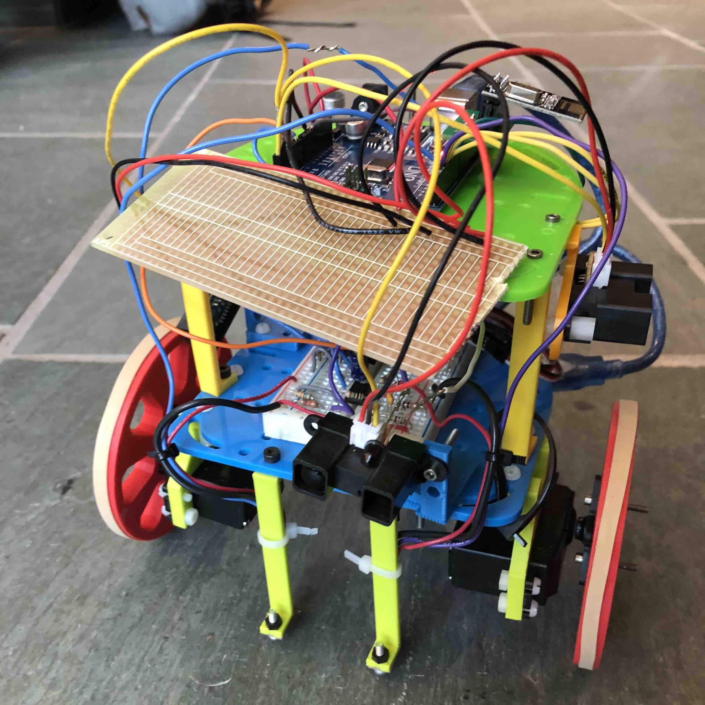
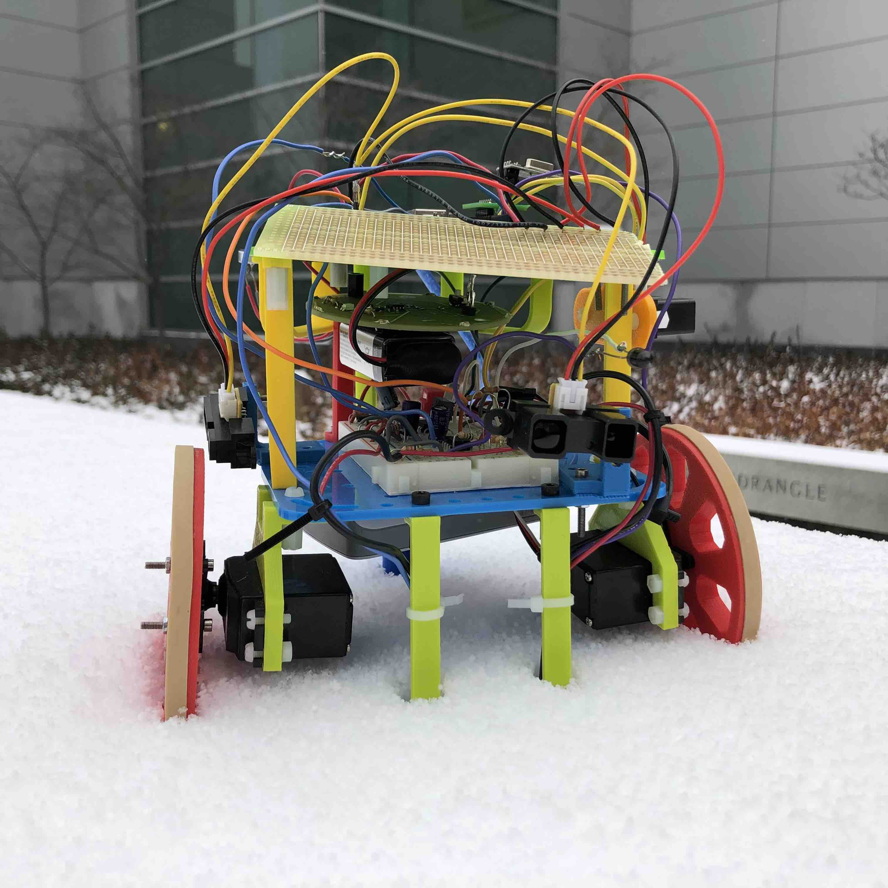
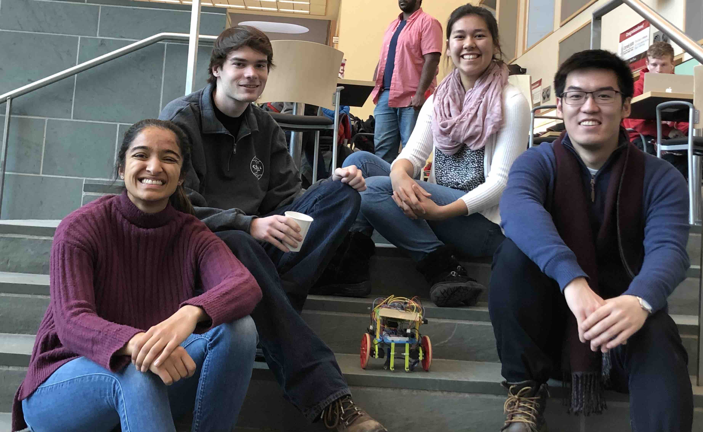

Final Design
============

## Robot Cost

We were given a $100 budget for our robot, and only used $69!

<table>
  <tr><td>Item</td><td>Number Used</td><td>Cost per Item</td><td>Total</td></tr>
  <tr><td>Line Sensors</td><td>2</td><td>$3</td><td>$6</td></tr>
  <tr><td>IR Distance Sensors</td><td>3</td><td>$7</td><td>$21</td></tr>
  <tr><td>Parallax Servos</td><td>2</td><td>$13</td><td>$26</td></tr>
  <tr><td>Arduino Uno</td><td>1</td><td>$16</td><td>$16</td></tr>
  <tr><td></td><td></td><td></td><td>$69</td></tr>
</table>

## System

At the conclusion of this project, our robot could start on a tone, line follow,
avoid other robots, map walls to a GUI, and solve a maze! It truly had a mind of
its own.

On the hardware side, we put phototransistor, audio, and pushbutton circuits on
a neat breadboard. The phototransistor circuit allowed us to sense other robots,
the audio circuit allowed us to detect a tone, and the pushbutton allowed us to
start the robot without a tone. This breadboard sat on the first layer of our
two-layered robot.

We placed the Arduino Uno on the second layer. The Arduino Uno acted as our
system’s microcontroller, and took inputs from our wall sensors, line sensors,
and breadboard circuits. It output to the servo motors and radio. The arduino
also powered the above-mentioned devices using its 5V power supply. The arduino
itself was powered by a battery bank that was velcroed neatly on the bottom of
the first layer. 

We placed a “power rail” next to the arduino. The power rail was essentially a
perf board with only ground and 5V (from the arduino) on it. We used this to
power sensors that did not require extra circuitry, particularly the wall
sensors. This power rail was added because our team had issues with wires
becoming loose. By soldering the powers together, this problem was mitigated. 

Our robot also featured an IR hat, which fit between the first and second layer.
This IR hat had 8 IR LEDs that could be detected by other robots, and was
powered with a 9V battery. During competition, our robot successfully avoided
other robots and was avoided by other robots! 

On the software side, we decided to use the Depth-First Search (DFS) algorithm
to search the maze, and the FFT library to detect robots and tones. The DFS
algorithm served us well, and worked consistently with our robot. As most of our
troubles were hardware-related, it was beneficial to have an algorithm that was
easy to visualize when debugging.

The FFT library, as stated above, helped us prevent collisions and start
consistently. The biggest dilemma we faced with the FFT library was its size.
Check out our Milestone 3 page to see how we counteracted this!

<figure class="multiimage">
  
  
  <figcaption>Our beautiful robot, Nine.</figcaption>
</figure>

## Future Improvements

Even though we are very proud of our robot, there is always room for
improvement! To future 3400 groups:

* Keep wires short, and solder as much as you can together. Try milling a
  one-sided PCB! 
* Be SUPER careful with your components... especially the radio. Accidentally
  burning out components can set you back weeks, which is no fun.
* Put your camera on your robot. Even if you struggle with colors or shapes, you
  might get points for treasure detection.
* Integrate as you go! While the milestones ensure that it gets done, it’s
  always helpful to be ahead of the game.
* Finally, and most importantly, have fun! Take this opportunity to learn, meet
  new people, and use your expertise to shine. It’s going to be okay, we promise :)

<figure>
  
  <figcaption>All smiles, even after the competition!</figcaption>
</figure>
