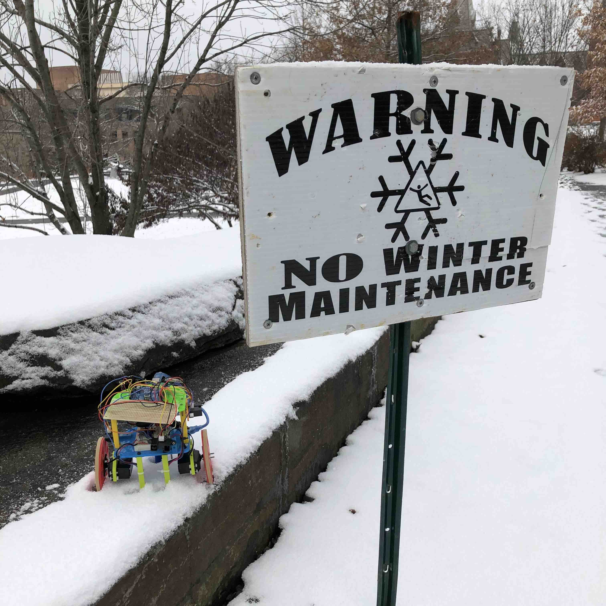

## Hello, and welcome to the [Nines][1]!

Explore this website to discover the progress of our robot, named Nine. You’ll
see it accomplish tons as each lab and milestone progresses!

* [Lab 1](lab1): The team gets accustomed to working with Arduinos and servos.
* [Milestone 1](milestone1): Nine drives along a line using IR line sensors.
* [Lab 2](lab2): The team uses circuits and FFTs to detect sound and IR signals
  of specific frequencies.
* [Milestone 2](milestone2): Nine gains wall sensors, and the ability to go
  around a wall and avoid other robots.
* [Lab 3](lab3): Nine gains a radio to send information about its surroundings
  to a computer, and a microphone to start moving on a tone.
* [Milestone 3](milestone3): Nine gains the ability to explore a full maze
  through depth-first search.
* [Lab 4](lab4): The team uses an FPGA and a camera to get live video and detect
  different colors.
* [Milestone 4](milestone4): The team uses the camera and FPGA to detect shapes
  and colors.
* [Robot Ethics](ethics): A discussion on whether a ban on autonomous offensive
  weapons would work.
* [Final Design](design): A summary of Nine's final design.

<figure>
  
  <figcaption>"No Winter Maintenance" has no effect on our team!</figcaption>
</figure>

[1]: https://s3.amazonaws.com/southfloridareporter/wp-content/uploads/2017/09/13084901/9fe4fa6a965562be6f2e97542d681168.jpg
