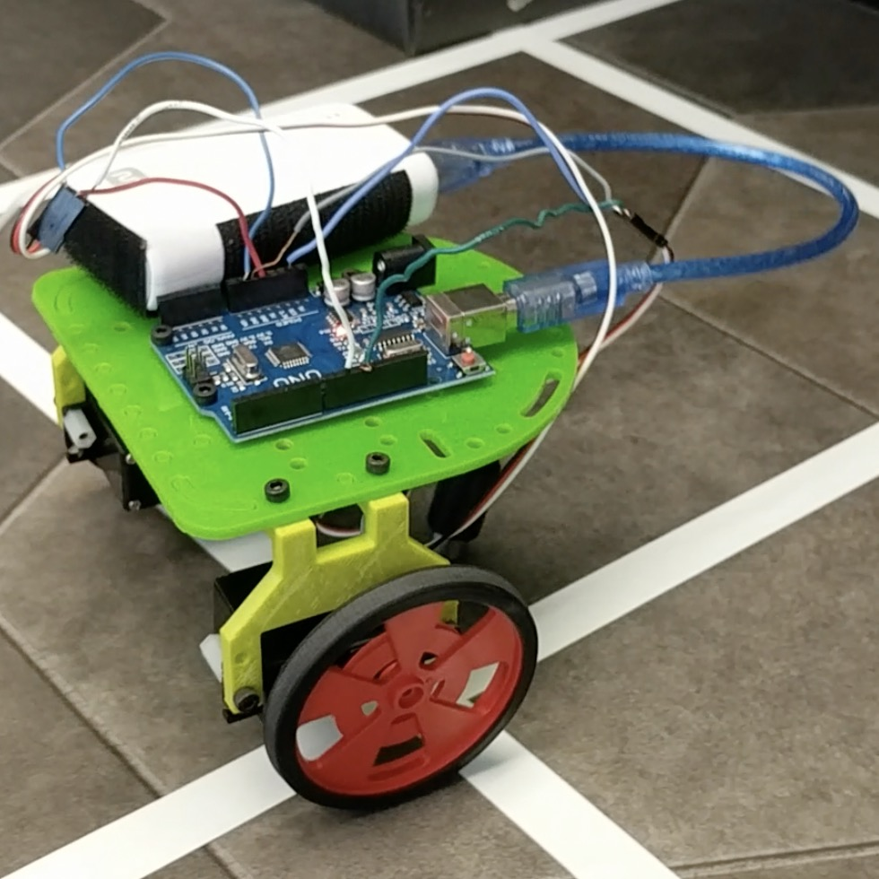

Lab 1: Microcontroller
==============

## Overview

The purpose of Lab 1 was to make us accustomed to some basic functionalities of
Arduino Uno and the Arduino IDE, such as assigning analog and digital outputs,
and driving peripheral devices (LED, Servos, etc). The ultimate goal of the lab
was to create an assembled robot that drives autonomously. 

The overall procedure of this lab can be summarized into following steps:

* Blink the onboard hardwired LED using the Blink sketch
* Modify the sketch so it can light up an external LED in series with a 330 Ohm
  resistor
* Read the Analog input from the potentiometer, and print the voltage values on
  the serial monitor 
* Use the Potentiometer to control the brightness of the external LED
* Test Drive a servo motor and calibrate the servo motor
* Control the rotation speed of the servo motor using  a potentiometer
* Assemble a robot and modify the code accordingly

### Required Parts:

* Team Box (arduino + USB Cable)
* 2 Continuous rotation servos
* 1 LED
* 1 Potentiometer
* Several resistors (330 Ohms)
* 1 solderless breadboard

Other than the required parts listed above, we also had to retrieve the frame
and motor mount. These secured the arduino board and mounted the motors,
respectively. We also needed a ball-bearing to keep the robot balanced.

## Modifying the Blink Sketch
This part of the lab required us to modify the Blink sketch to light up a LED
for 1 second, then off for one second (and repeat). We first did this for the
onboard LED, and then applied this to an external LED.

<iframe width="560" height="315" src="https://www.youtube.com/embed/fxkYw2AP_nM" frameborder="0" allow="autoplay; encrypted-media" allowfullscreen></iframe>

## Reading a Potentiometer
This part of lab asked us to read the voltage across a potentiometer, and then
display these values in the serial monitor.

<iframe width="560" height="315" src="https://www.youtube.com/embed/xnN_W6IVzuE" frameborder="0" allow="autoplay; encrypted-media" allowfullscreen></iframe>

## LED Brightness with Potentiometer Control
We then modified our LED code to read the voltage across a potentiometer, and
change the LED brightness based on that voltage. The higher the voltage, the
brighter the LED. 

<iframe width="560" height="315" src="https://www.youtube.com/embed/mlmOFEEA1_I" frameborder="0" allow="autoplay; encrypted-media" allowfullscreen></iframe>

## Driving a Servo Motor
We connected the Servo motor as follows: the red wire went to 5V output, the
black wire went to ground, and the white wire went to the digital pin with PWM
capability (in our case, it was digital pin 11). The servo motor started to
rotate after the arduino was powered up.

<iframe width="560" height="315" src="https://www.youtube.com/embed/MmK_6IldTSA" frameborder="0" allow="autoplay; encrypted-media" allowfullscreen></iframe>

## Driving a Servo Motor with Potentiometer Control
We modified the Servo Motor code to change speeds based on the voltage across a
potentiometer. 

    #include "Servo.h"

    int Potential = A1;
    int num = 0;
    float volt = 0;
    int motor = 11;
    Servo servo;

    void setup() {
      Serial.begin(9600);
      pinMode(Potential, INPUT);
      servo.attach(motor);
    }

    void loop() {
      num = analogRead(Potential);
      volt = num*180.0/1023.0;
      servo.write(volt);
      delay(1000);
    }

<iframe width="560" height="315" src="https://www.youtube.com/embed/xezbXnCbrWQ" frameborder="0" allow="autoplay; encrypted-media" allowfullscreen></iframe>

## Assembling the Robot
This part of the lab required us to attach the arduino and battery to the
platform, assemble the wheels and ball bearing, and mount the motors.

## Integrate Arduino Sketch and robot
We tested different servo motor inputs to understand basic controls. These
inputs caused the robot to go straight, turn left, turn right, and perform
these activities at different speeds.

## Robot Autonomous Drive
Our robot's first autonomous drive included a quick dash forward, a 360 degree
turn in place, followed by another dash forward. We were so proud!

<iframe width="560" height="315" src="https://www.youtube.com/embed/XuW5_kAFOnM" frameborder="0" allow="autoplay; encrypted-media" allowfullscreen></iframe>

