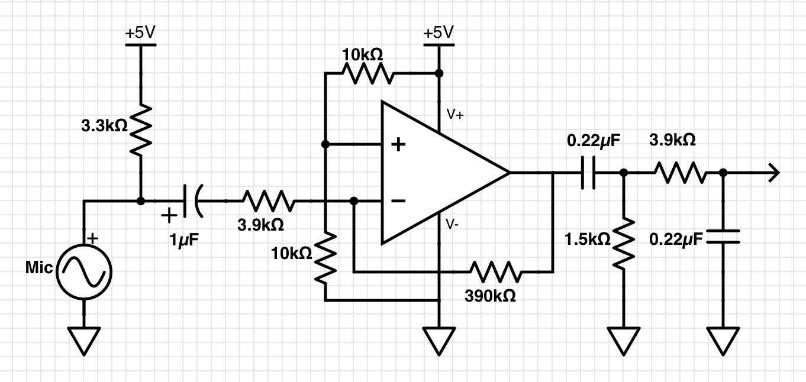
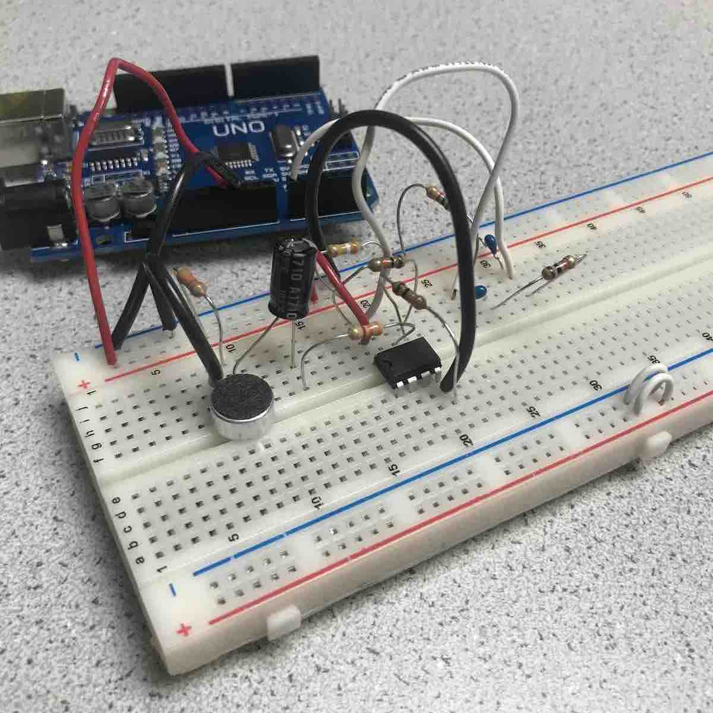
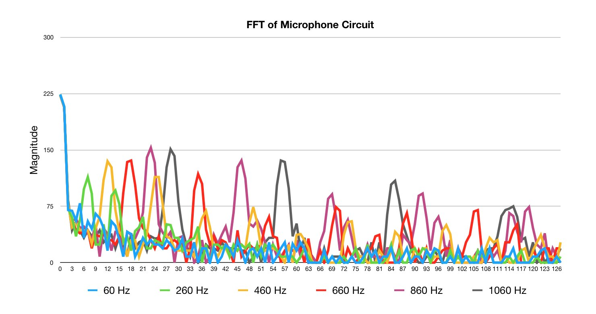
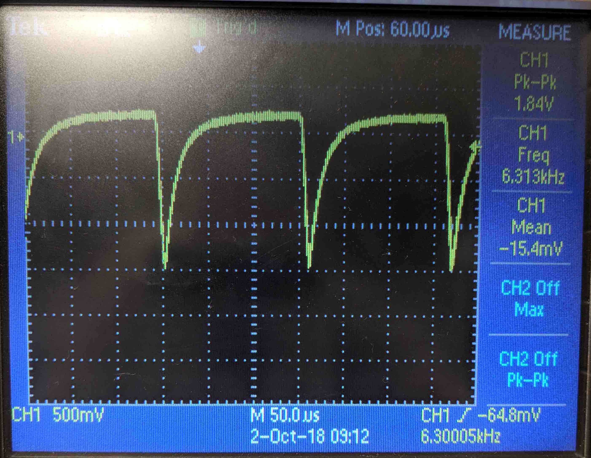
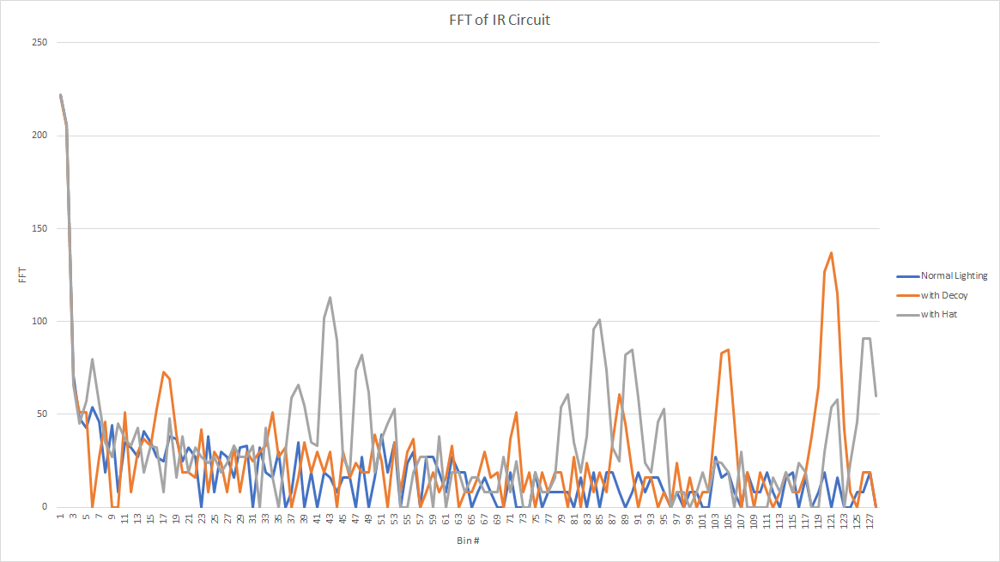
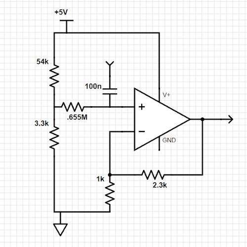
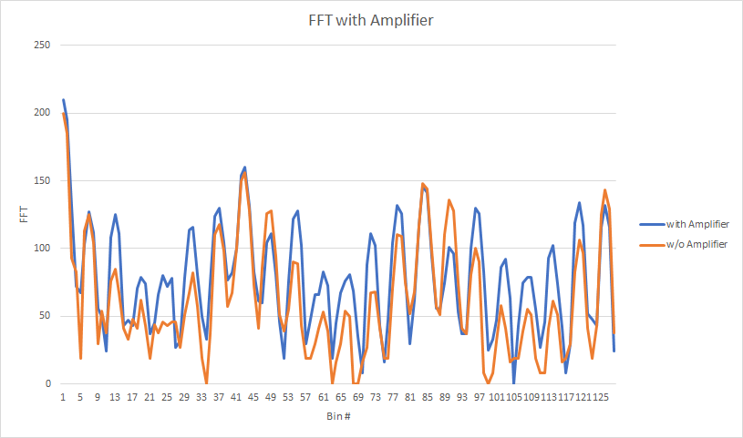

Lab 2: Analog Circuitry and FFTs
================================

## Overview

The purpose of Lab 2 was to familiarize us with the FFT (Fast Fourier Transform)
and analog-to-digital converters on the Arduino. By doing so, we could implement
peripheral devices such as phototransistors and microphones. The ultimate goal
of the lab was to ensure our robot would start moving at a 660Hz tone, and avoid
other robots emitting a 6.8kHz IR light. The robot was to ignore 18kHz decoy
light and ambient sound in the room.

### Required Parts:

* Team Box (two Arduinos + USB cables)
* 1 Phototransistor
* 1 LED
* 1 Microphone
* 1 Provided IR hat
* 1 Provided IR Decoy
* Several resistors, capacitors (shown in diagrams below)
* 2 Solderless breadboards

The team was divided into two sub-teams: acoustic and optical. Each team’s tasks
are listed listed below: 

## Acoustic Team

Mark and Gauri worked on this portion of the lab. The overall procedure can be
summarized into following steps:

* We first checked that the example script from the FFT library
  (fft\_adc\_serial) was working correctly by connecting the function generator
  to the Arduino with a resistor and capacitor. We expected the Arduino script
  to show us the FFT of the signal produced by the function generator.
* Unfortunately, the FFT library was incompatible with the Arduino 1.8.6
  version. We downloaded Arduino 1.8.5 so the script could run. Make sure to do
  this!
* We then built the microphone circuit without an amplifier or filter, and
  checked the circuit's output with an oscilloscope for different frequencies.
* The voltages produced by the mic were far too small to be reliably processed
  by the Arduino. So, we then added an inverting amplifier with -100 gain and a
  +2.5 V bais to make the signal large enough and positive. 
* Lastly, we added a band-pass filter centered at 660 Hz to the circuit in order
  to remove noise. This final circuit is shown below: 

* We observed the circuit’s output again with the oscilloscope, and found that
  660 Hz would produce the highest output amplitude compared to neighboring
  frequencies. The band-pass filter worked, and the output signal was more
  accurate.
* We then connected the new microphone circuit to the Arduino (with the
  fft\_adc\_serial sketch uploaded). We decided to set the prescaler for the ADC
  to 128 in order to give a bit more precision in the FFT. Each bin then
  contained: 16MHz / 128 prescalar / 13 clock cycles / 256 samples =
  37.6 Hz/bin. As such we expected the 660Hz signal to show up in bin 17. We
  plotted the FFTs for several different frequencies played into the microphone,
  as shown below:

* We then modified the sketch to have the Arduino turn on its LED when it
  detects a 660 Hz sound:

<iframe width="560" height="315" src="https://www.youtube.com/embed/GJKTKxlizJg" frameborder="0" allow="autoplay; encrypted-media" allowfullscreen></iframe>

## Optical Team

Stark and Diane worked on the Optical portion of this lab. We first built the
phototransistor circuit with a 1.8k Ohm resistor, and powered the IR hat with a
9V supply. We observed the following output on the oscilloscope:

We then loaded the fft\_adc\_serial sketch (from the IDE FFT library) onto the
Arduino Uno, and plotted the results.

When the IR hat was present, we observed a cluster of peaks near bins 42, 84,
and 126. This is what we expected. There are clusters because the output is not
perfectly sinusoidal, and these clusters appear in multiple places due to their
harmonics. 

The bin location is also as expected. The IR hat emits a frequency of 6.08 kHz.
The ADC clock runs at 500 kHz, set by the “ADCSRA = 0xe5” line in the sketch.
Thus we calculated the bin width to be 16MHz / 32 prescalar / 13 clock cycles /
256 samples = 150 Hz/bin. The FFT peaks should end up near the 6.08 kHz / 150
Hz/bin = 40th bin, and the corresponding harmonics. 

We also plotted the FFT when the decoy was present. Because it peaks in a much
higher bin (due to its 18kHz frequency), we decided that a filter would not be
necessary. We did decide, however, that an amplifier would be beneficial. With
an amplifier, the Arduino could detect the light from further distances. The
following non-inverting amplifier was built:

In the amplifier circuit, a DC bias voltage was added to avoid clipping. This
was created with the 54k and 3.3k resistors, whose values were chosen after
experimentation. With the amplifier in place, we re-plotted the FFT transform. 

The new FFT showed amplification around the main peaks.

We then added the following lines to the fft\_adc\_serial sketch. This lit the
Arduino’s built-in LED when the IR hat was nearby.

    if (fft_log_out[43] > 100)
        digitalWrite(LED_BUILTIN, HIGH);
    else
        digitalWrite(LED_BUILTIN, LOW);

<iframe width="560" height="315" src="https://www.youtube.com/embed/Y4xkMnaVo4M" frameborder="0" allow="autoplay; encrypted-media" allowfullscreen></iframe>

Finally, we integrated both systems. Our Arduino can react to both a 660 Hz tone
and 6.8 kHz light, while ignoring a 18 kHz light!

<iframe width="560" height="315" src="https://www.youtube.com/embed/ycQzP19MoYk" frameborder="0" allow="autoplay; encrypted-media" allowfullscreen></iframe>

## FFT Crash Course

Human ears perform a Fourier transform by converting sound---the pressure waves
traveling over time through the air---into a spectrum, so that we can recognize
multiple pitches being heard at the same time.

The algorithm that we used in this lab, the Fast Fourier Transform, resembles
this process of separating a single stream of information into its component
frequencies. FFT is an implementation of the discrete Fourier transform, which
takes an array representing the value of a signal at discrete points in time,
and creates an array representing the magnitude of different frequency
components in the signal. FFT computes this transform in O(n log n) time, and as
such has become somewhat of a standard for frequency analysis on computers.

For the purpose of this lab, we used OpenMusic Lab’s FFT library to analyze the
signals collected by our sensors. The signals collected from the microphone and
phototransistor were processed using the library’s fft\_adc\_serial sketch. We
were then able to use the frequency data to have the Arduinos react to signals,
and to create plots of the frequencies recieved. 

