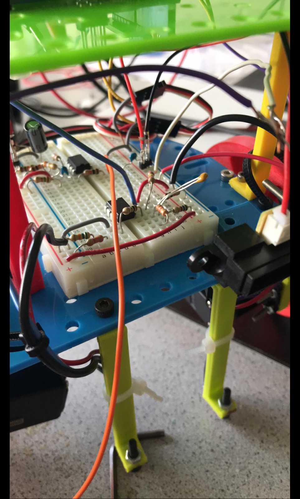

Lab 3: System Integration and Radio Communication
=================================================

## Overview

The purpose of Lab 3 was to implement radio communication between the robot and
base station, and to integrate previous labs and milestones. By implementing the
radio communication, we could see the the maze’s walls appear on our base
station’s GUI. By integrating our previous labs and milestones, our robot could
start on a 660 Hz tone, avoid other robots, and ignore decoys while updating
the GUI with full maze exploration. 

### Required Parts
* Team Box (two arduinos + USB cables)
* 1 Phototransistor (and amplifier circuit)
* 1 Microphone (and active filter circuit)
* 1 IR hat
* 1 IR Decoy
* 2 Nordic nRF24L01+ transceivers
* 2 radio breakout boards with headers

## Maze Encoding

In order to store all the known information about the maze on the robot, we
needed to have an efficient encoding of the important information, so as to not
run out of memory space on the Arduino. We decided to use a two-dimensional
array to represent the 9x9 grid, with each element being one byte, encoded as
`{ x, s1, s0, c, n, e, s, w }`, where:

* `x` represents whether the position has been explored
* `s1` and `s0` represent the shape of a treasure present, if any. (No treasure
  = 00; Circle = 01; Triangle = 10; Diamond = 11)
* `c` represents the color of the treasure (Blue = 0; Red = 1).
* `n`, `e`, `s`, and `w` represent whether or not there is a wall in the
  respective directions of the position.

## Radio Team

The radio team’s goal was to implement the radio communication and base station
GUI. To test the radios, we downloaded the RF24 Arduino library and uploaded
the “Getting Started” sketch to both Arduinos, which allowed us to transmit
data between the Arduinos.

We then wrote [the code](https://github.com/anastos/teamnine/blob/master/receiver/receiver.ino)
for the receiver Arduino, which receives data from the robot about the maze,
transforms that data into a string that the GUI is able to parse, and then
prints the string to the serial monitor so that the GUI can present the
information. We decided to send three-byte transmissions from the robot to the
receiver, consisting of the robot’s current x and y coordinates and the
corresponding byte as described in the maze encoding.

We then wrote a [robot simulator](https://github.com/anastos/teamnine/blob/master/sim_transmitter/sim_transmitter.ino),
which transmits data as if it were a robot traversing a maze, without actually
moving. This helped us determine if the radios and the receiver code were working.

After this, we worked on integrating the radio transmissions into the main robot
code. In addition to creating the 2-D byte array for the grid data, we had to
keep track of the robot’s current x and y coordinates. We also needed to store
its orientation so that we could record walls in the correct positions, and
update the coordinates correctly as the robot moves forward. We based the actual
radio transmission code on the code from Getting Started. The robot was then
able to explore a maze and transmit information about it to the GUI.

<iframe width="560" height="315" src="https://www.youtube.com/embed/Uv-DoCww0Xw" frameborder="0" allow="autoplay; encrypted-media" allowfullscreen></iframe>

## Robot Team

The robot team’s goal was the integrate the previous labs and milestones. To do
so, the robot was first rebuilt. Previously, the robot was structured in two
layers: the top contained the IR phototransistor circuit, and the bottom
contained the Arduino. These two layers were switched so the Arduino’s pins
could be more easily accessible. The microphone’s active filter was also added
to the robot, and wires were shortened to obtain a cleaner breadboard.

We were than able to integrate the microphone into the main code, so that the
robot only starts exploring after it hears a 660Hz tone:

<iframe width="560" height="315" src="https://www.youtube.com/embed/2kM76B30kLQ" frameborder="0" allow="autoplay; encrypted-media" allowfullscreen></iframe>

We also integrated the IR detection, such that the robot stops when it sees
another robot:

<iframe width="560" height="315" src="https://www.youtube.com/embed/TtICiw_sR3o" frameborder="0" allow="autoplay; encrypted-media" allowfullscreen></iframe>

But also avoids decoy robots:

<iframe width="560" height="315" src="https://www.youtube.com/embed/9HWRwdr_71k" frameborder="0" allow="autoplay; encrypted-media" allowfullscreen></iframe>

