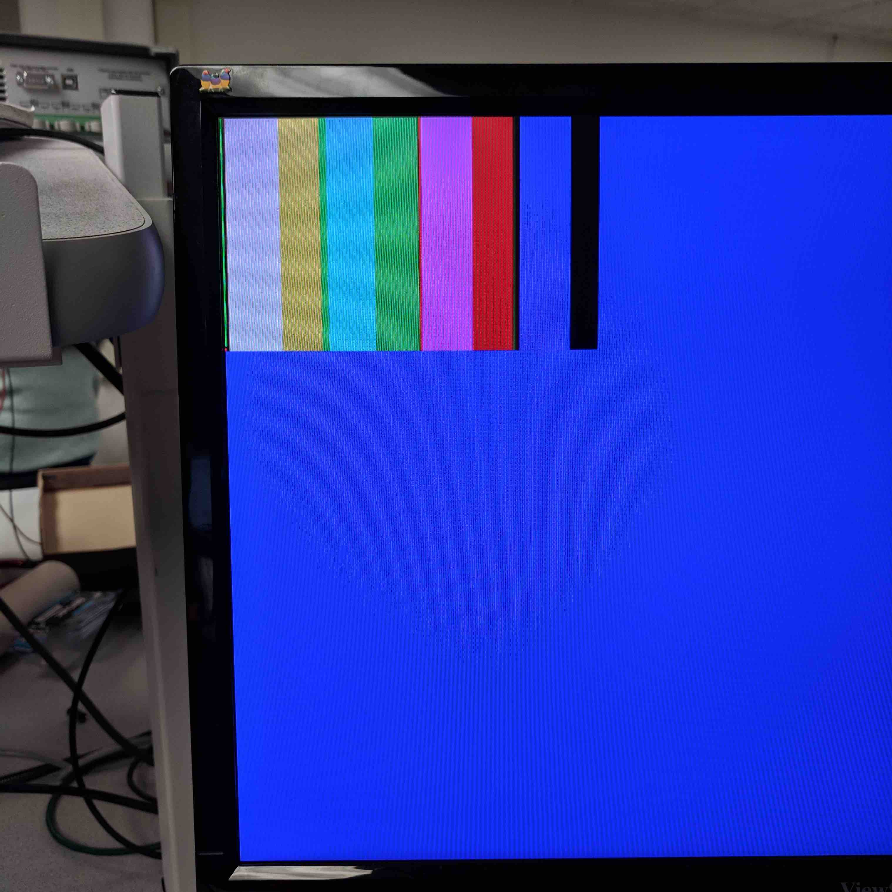

Lab 4: FPGA and Shape Detection
===============================

## Overview

The purpose of Lab 4 was to implement a treasure detection system on the robot. We did this by connecting the OV7670 Camera to the arduino and to a DEO-Nano FPGA. The FPGA generates a 24 Hz clock for the camera, and interprets the camera’s data. This lab, the FPGA determines the primary color of the camera images, and communicates this information to the Arduino.

### Required Parts
* Team Box (two arduinos + USB cables)
* 1 OV7670 Arduino Camera Module
* 1 VGA cable
* Female-female wires
* 2 FPGAs

## Arduino Team

The arduino team was in charge of looking at the datasheet for the OV7670, and setting the appropriate registers of the device. The registers were written to reset all registers, set up color bars, define the resolution to RGB 565, set the gain ceiling, enable scaling, set up the external clock, and allow mirroring. Most of these were specifically outlined in the prelab.

We first defined each register. The following is an example: 

    #define CLKRC  0x11 

We then wrote to each register. For `CLKRC`, the following line was added:

    OV7670_write_register(CLKRC, 0xC0);

By writing `0x0C` to `CLKRC`, we enable the use of an external clock.

In this lab, we determined how to receive the data. We chose to use RGB 565 so we could receive maximum information before downsampling. The VGA transmits one byte per clock cycle, so a pixel via 565 would be received every two clock cycles. In the same amount of time, using RGB 555 or 444 would transfer less data.

To enable RGB 565, we wrote `COM15` to `0xD0`.

We also took into account that the FPGA and Arduino deal with read and write bits differently. While the arduino adds a bit onto the end, the FPGA uses the full number of bits and specifies based on whether the LSB is 1 or 0. Because of this, we defined the camera address to be the right-shifted value of its original address which is `0x42` or `0x43` based on read or write. `0x42` right shifted is `0x21`.

We connected the FPGA and assigned the GPIO_00 to be the 24-MHz output clock for the OV7670 camera module. We used oscilloscope to check the output signal to be 24-MHz. The ground line was shared between FPGA and arduino and camera. The code provided was modified to in order to write and read each registers to our desired values. We were able to print out the values of each register onto the serial monitor to check the correctness. We first reset all the registers (`0x12`) by setting it to `1000000` which in hex is `0x80`. We then enable our desired VGA format setting by setting the register to `00000110` (`0x06`).  

## FPGA Team

The first thing that we did for the FPGA was instantiate a phase-locked loop (PLL) in order to convert the given 50 MHz clock to output other clock speeds (24 MHz and 25 MHz). The 24 MHz clock was used by the camera, and the 25 MHz clock was used for several things including the VGA connection and writing to the FPGA’s RAM. We encountered a strange problem that the clock outputs from the FPGA over GPIO were 5 V peak to peak, even though the FPGA is only supposed to support 3.3 V. Because the camera also only supports 3.3 V, we used a voltage divider circuit to reduce the voltage before sending it to the camera. 

We then wrote code to display a simple pattern on the screen. Because the VGA output is connected to the data in RAM, we needed to write the pattern to the RAM. To do this, we iteratively cycle through the RAM addresses, and assign the color for each position on screen to the RAM. Our simple patterns were primarily just making half of the screen one color, and the other half another. We ran into a problem doing this in that it wouldn’t look correct on the screen if the register containing the data being written to the RAM was initialized to 0. Initializing this register to any other value seemed to fix the issue. The following code displays a pattern with the top of the screen red and the bottom green:

    always @(posedge clk_50) begin
        W_EN = 1;
        if (X_ADDR == `SCREEN_WIDTH - 1) begin
            X_ADDR = 0;
            if (Y_ADDR == `SCREEN_HEIGHT - 1)
                Y_ADDR = 0;
            else
                Y_ADDR = Y_ADDR + 1;
        end
        else
            X_ADDR = X_ADDR + 1;
        pixel_data_RGB332 = Y_ADDR < 70 ? RED : GREEN;
    end

The next step was to connect the camera to the FPGA. To interpret the data sent by the camera, in addition to the data and the clock, we needed to use the VSYNC and HREF signals. When VSYNC is 1, that means the camera has finished sending a frame, and the next data will be at position (0, 0). When HREF is 0, that means the camera has finished sending a row, and the next data will be the start of the next row. Because the camera sends data in the two-byte RGB565 format, and the FPGA only has enough RAM space to store one byte per pixel (RGB332), we needed to downsample the color data by simply taking the most significant bits from each of the colors, namely:

    RGB332[7:0] = { RGB565[15:13], RGB565[10:8], RGB565[4:3] }

After writing the downsampler, and many technical difficulties involving bad wires between the camera and the FPGA, we were able to display the color bar from the camera on the screen:

We then modified the Arduino code to show the live camera image:

<iframe width="560" height="315" src="https://www.youtube.com/embed/51GvlBjDLdk" frameborder="0" allow="accelerometer; autoplay; encrypted-media; gyroscope; picture-in-picture" allowfullscreen></iframe>

To detect different-colored treasures, we first set thresholds for each color. We decided a pixel was white if `PIXEL_IN[7]`, `PIXEL_IN[4]`, and `PIXEL_IN[1]` were 1, where `PIXEL_IN` is the down-sampled camera data. These bits of `PIXEL_IN` correspond to the most-significant bit of red, green, and blue, and expect to be high when the picture is white. We decided a pixel was red if the pixel was not white, and the most-significant bit of red (`PIXEL_IN[7]`) was 1. We decided a pixel was blue if the pixel was not white, and either `PIXEL_IN[1]` or `PIXEL_IN[0]` was 1.

We then divided the screen into 3 sections: top, middle, and bottom. These sections were of equal size (ie. equal number of rows). To determine the color of a treasure, we counted the number of red and blue pixels in the middle section. If the middle section contained more red pixels, we determined the treasure to be red. Similarly, if the middle section contained more blue pixels, we determined the treasure to be blue.

In the following video we used the screen background to represent which color is being detected:

<iframe width="560" height="315" src="https://www.youtube.com/embed/TBPw4rzP1vI" frameborder="0" allow="accelerometer; autoplay; encrypted-media; gyroscope; picture-in-picture" allowfullscreen></iframe>

In order to send information about treasures from the FPGA to the Arduino, we decided to use parallel communication with three wires. When the robot arrives at an intersection, the camera system will detect whether or not there is a treasure in front of it. The Arduino will then read the three digital pins and set the appropriate bits in its maze data structure. As discussed in [Lab 3](lab3), three bits is sufficient to encode the existence, color, and shape of a treasure.

    if (fwall) {
        if (digitalRead(FPGA_PIN_0) == HIGH) grid[x][y] |= 16;
        if (digitalRead(FPGA_PIN_1) == HIGH) grid[x][y] |= 32;
        if (digitalRead(FPGA_PIN_2) == HIGH) grid[x][y] |= 64;
    }
