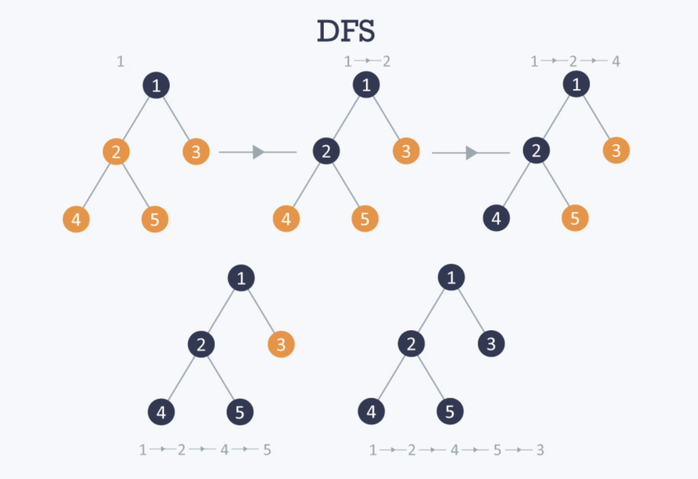
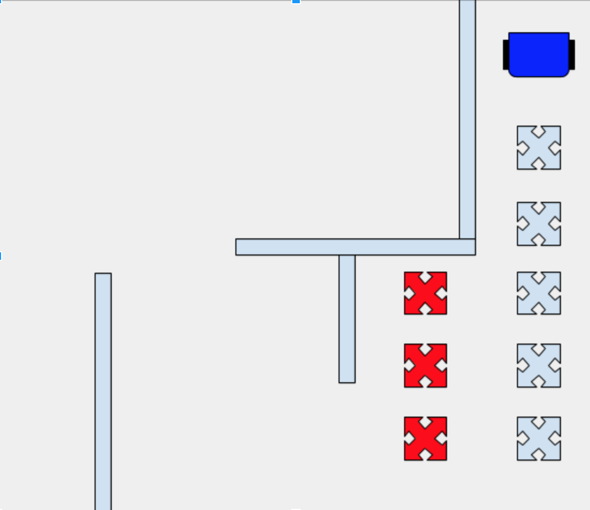
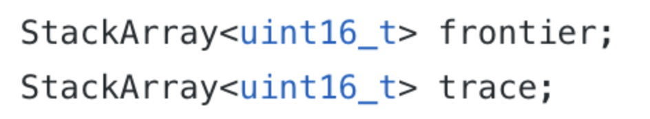
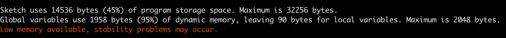

Milestone 3
===========

## Goal

The goal of this milestone was to show that our robot was capable of  exploring the full maze using DFS, BFS, Dijkstra, or A* algorithm while also updating the GUI.

## Algorithm Procedure

We implemented Depth First Search (DFS) algorithm on the robot to traverse the maze. Here is a crash course on DFS algorithms:

The above example demonstrated the concept of DFS using binary trees. Basically what DFS does is that when visiting a node, it would go through the nodes’ children before it visits the nodes’ siblings. In the picture, we visit node 1 -> 2 -> 4, then we know that 4 has a sibling which is 2’s other children, which is 5, so we then go to 5, 1->2->4->5 and so on and so on until we visited all the nodes in the tree. 

The same concept applies to the maze, as we mapped the whole maze into a grid system and throughout the process, we have to keep track of the visited nodes and unvisited nodes. The neighbors added to the frontier end up being all the adjacent coordinates to the current location of the robot if there is no wall obstructing that direction.

The blue x’s represent the dfs algorithm planned path and the red x’s represent the unvisited sibling nodes that would be saved in the stacks. 

We used most of the code from Lab 3 in terms of implementing sensor functionality, but in order to implement DFS, we needed to incorporate the Stack data structure. We found an Arduino StackArray library online and included it in our Arduino Libraries folder. Our algorithm used two stacks, one to keep track of the frontier set of unvisited nodes and one to keep track of our the robot’s path to the current location. The second stack isn’t conventionally part of the DFS algorithm, but because the robot actually needs to retrace its steps to reach the frontier nodes, we needed the “tracing” stack as well. The trace stack is only used when the robot reaches a dead end and needs to use the frontier stack to find the next possible path. During this time, we discontinue the DFS algorithm and focus on finding the next available path. While the robot retraces the trace, we pop those values from the trace because the robot should not come back to this dead end again. 

The robot should continue on the trace stack until it is adjacent to the next value in the frontier stack with no wall in the way. If this scenario happens, the robot should be able to make its way to that adjacent frontier node and begin the regular DFS again. The algorithm will end when the frontier stack is empty!

Another nuance in our algorithm was how we stored the stacks using the uint16_t type (declaration shown below) because in order to conserve memory, we wanted to be as efficient as possible with how we represented grid coordinates. Therefore every 2d grid coordinate can be represented with a 16 bit integer in the stack where 8 most significant bits were used for the x-coordinate and the second 8 bits represented the y-coordinate.

Lastly, because all the neighbors are connected in a grid format, this is essentially a graph with many cycles in it. Therefore, unlike a regular DFS in a binary tree, we cannot simply assume that everything in the frontier will always be unvisited. In other words, while we do make sure that a node initially added to the frontier is unvisited, that same node might get visited from a different path later on in the algorithm, yet it would still be in the frontier stack. In order to account for that, whenever the robot reaches a dead end and needs to find the next frontier node, we first make sure to pop any values off the frontier that have already been visited. That way, the robot is sure to head back to the frontier value that is unvisited and needs to be explored. 

## Here is the skeleton pseudocode for our dfs algorithm: 
   
    dfs()
        -currVal = frontier.pop()
        -trace.push(currVal)
        -Visited[x][y] = 1
        -Making sure to account for orientation
            -if there is no wall on the left
                -add left coordinate to frontier
            -if there is no wall on right
                -add right coordinate to frontier
            -if there is no wall forward 
                -add the forward coordinate to the frontier
        -If frontier is empty
            -Algorithm finished!
        -If nothing was added to frontier in this call (dead end)
            -Start following trace and pause dfs
        -Else 
            -Orient robot to direction of next value in frontier and continue dfs

## Efficient Memory Usage

The non-algorithmic challenge with this lab was dealing with unstable memory problems due to a majority of the dynamic memory being used in the arduino. We got a message looking like this. 

In order to combat this, we decided to try to reduce the size of the FFT library from 256 buckets to 128 buckets because it doesn’t need to be that precise in order to detect 660 Hz. The other change we needed was to sample the correct bucket after the change, and after running tests on what the new FFT values looked like, we found that the new peak for 660 Hz noise happened at bucket 9. We also had to change the threshold frequency to be a bit higher now that the number of buckets decreased. We used this same process to also change the IR detecting buckets. The detection was a little weaker, but still fairly accurate. 

#Here is a video of the algorithm with the radio updates!

<iframe width="560" height="315" src="https://www.youtube.com/embed/MKExI6S6vzE" frameborder="0" allow="accelerometer; autoplay; encrypted-media; gyroscope; picture-in-picture" allowfullscreen></iframe>

